# 基于轮胎特性的 Formula Student 赛车悬架参数设计与验证

可编辑文本源。DOCX 与 PDF 由 `scripts/build_design_report.py` 使用同一内容结构生成。

> 证据边界：Pre-Adams 几何检查不是 Adams/Car 仿真结果。

## 摘要与结论先行

> **报告定位：** 本报告不是单独介绍轮胎或悬架，而是说明轮胎试验特性如何转化为悬架需求，并用这些需求对已经进入制造阶段的第九版硬点做后验验证。

现有证据形成了一条可用于答辩的主线：TTC 数据说明轮胎对垂向载荷和倾角敏感；因此过弯时四轮载荷、动态外倾和前后轴载荷转移分配不能分开讨论。PAC2002 和 MATLAB 结果用于把轮胎特性量化，最终再由悬架几何、侧倾中心、轮端刚度和阻尼去实现或管理这些目标。

| 问题 | 现有证据给出的回答 | 答辩口径 |
| --- | --- | --- |
| 45% LLTD 是否合理 | 在现有载荷敏感性模型中处于可用工作区；不是唯一数学最优 | 称为当前 baseline 与平衡目标 |
| 1.8g 时谁最重 | OR 1130.9 N，OF 800.5 N | 外侧后轮是最高载荷轮胎 |
| 硬点是否已验证 | 完成二维 Pre-Adams 几何检查 | 不能称为 Adams 结果 |
| 弹簧是否已有最终规格 | 只有轮端刚度/侧倾趋势参数研究 | 最终值需 motion ratio 与试车 |
| 阻尼是否定型 | 没有本车实测 dyno 曲线 | 只能讲方法与后续计划 |

> **最重要的工程结论：** 轮胎并不能直接给出一个硬点坐标，而是先给出目标轮胎状态；硬点设计的任务，是通过悬架运动学和动力学尽量实现这个状态。

## 目录与阅读方法

| 章节 | 核心问题 | 主要证据 |
| --- | --- | --- |
| 1–4 | 轮胎告诉悬架什么 | FY–SA、μ–FZ、Camber sensitivity、PAC2002 |
| 5 | 硬点如何受到轮胎约束 | 第九版硬点、Pre-Adams camber |
| 6–7 | 45% LLTD 如何实现 | LLTD sweep、roll center、弹性侧倾刚度分配 |
| 8–9 | 弹簧/阻尼如何影响轮胎 | wheel-rate 参数研究、阻尼资料审计 |
| 10 | Adams 做到哪里 | Adams input CSV 与状态说明 |
| 11 | 1.8g 四轮处于什么状态 | 四轮 FZ、载荷模型能力、Pre-Adams 姿态框架 |
| 12–15 | 当前设计能说什么、还缺什么 | 证据分级、限制、后续测试计划 |

> **非悬架成员阅读建议：** 先看摘要、第 4 章方法链、第 6 章 45% LLTD、第 11 章 1.8g 案例和最后一页逻辑图；需要准备技术追问时再看硬点、侧倾中心和弹簧章节。

术语第一次出现时均用大白话解释。图中英文缩写保留，是为了与 MATLAB、Adams 和答辩资料保持一致。报告末尾附有证据追溯表，方便确认每一个数字来自哪个 CSV 或脚本结果。

## 1. 引言：为什么轮胎是悬架设计的起点

赛车最终通过四个轮胎接触地面。悬架本身不产生横向抓地力，它的工作是让轮胎在制动、转向、过路肩和车身侧倾时保持尽可能合适的垂向载荷、倾角、滑移角和接地状态。因此，悬架参数不能只按“Formula Student 通常怎么做”来解释，而应回到本车轮胎在真实试验条件下表现出的规律。

本项目的真实开发状态是：第九版悬架硬点已经完成并进入制造阶段。本报告不伪造“PAC2002 优化算法直接生成当前硬点”的历史，而是以轮胎数据作为需求源，对现有几何进行定量解释和后验验证；对于静态外倾、弹簧、阻尼等仍可调项目，再用模型给出调校方向。

> **核心问题：** TTC 和 PAC2002 得到的 Load、Camber、Slip 特性，怎样一步一步变成 Dynamic Camber、LLTD、Roll Center、Wheel Rate 和 Damper 的要求？

- 先确认轮胎在不同 FZ、IA 和 SA 下的真实趋势。
- 再把轮胎趋势翻译成可检查的悬架目标。
- 最后区分已算出的结果、Pre-Adams 几何结果和仍未完成的 Adams 仿真。

## 2. 车辆基准、轮胎模型与证据等级

| 项目 | 采用值 | 来源/说明 |
| --- | --- | --- |
| 满载质量 | 280 kg | vehicle_inputs_and_consistency.csv |
| 轴距 | 1580 mm | 项目车辆基准 |
| 重心高度 | 280 mm | 项目车辆基准 |
| 最大横向加速度 | 1.8 g | 极限横向案例 |
| 静态轴荷 | 前 40% / 后 60% | 项目车辆基准 |
| LLTD | 前 45% / 后 55% | 当前设计 baseline |
| 硬点 | E18 第九版最终版 | 几何分析权威输入 |
| 轮胎 | Hoosier 43075, 7 in rim | 当前选型与轮胎证据 |

| 证据等级 | 定义 | 本报告实例 |
| --- | --- | --- |
| Level 1 | TTC 试验数据 | FY–SA、μ–FZ、IA 分箱 |
| Level 2 | 模型/计算 | PAC2002、LLTD、1.8g 载荷、弹簧研究、Pre-Adams |
| Level 3 | Adams/Car 实际仿真 | 目前尚无可验证输出 |

> **边界：** 带有 Pre-Adams 标记的 camber、roll center 和 1.8g 姿态坐标属于 Level 2，不得升级为 Level 3。

## 3.1 FY–SA：轮胎怎样随滑移角建立横向力

Slip Angle（滑移角，SA）可以理解为车轮指向方向与轮胎实际运动方向之间的夹角。SA 从零开始增大时，轮胎横向力 FY 先近似线性增加，随后逐渐饱和。曲线初段斜率称为 Cornering Stiffness（侧偏刚度），它反映轮胎对小转向输入建立横向力的快慢。

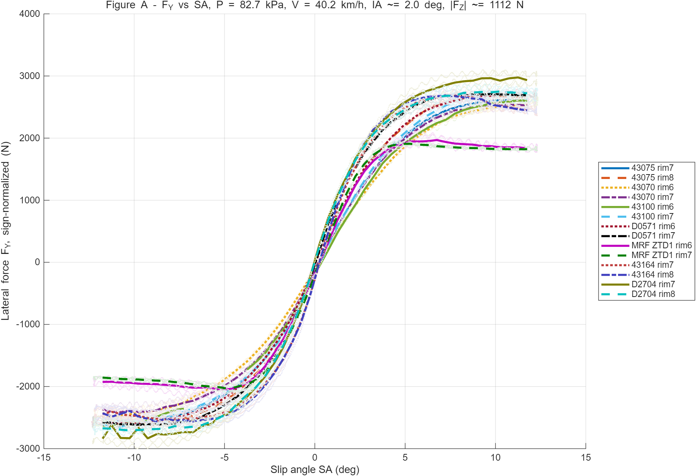

**图 1 现有 TTC 对比窗口中的 FY–SA 曲线**

这张图说明什么：不同轮胎和轮辋组合的横向力随滑移角建立并进入饱和，说明轮胎可用横向力不是与转角无限线性增长。

它对悬架设计意味着什么：悬架和转向几何应避免过大的 bump steer、toe change 或姿态变化，让轮胎长期偏离有效 SA 区域。

> **当前选型窗口：** 43075 rim 7 的现有表格给出侧偏刚度约 579.8 N/deg、峰值附近 SA 约 9.85 deg；这些数字只适用于已筛选的试验窗口。

## 3.2 PAC2002：从试验曲线到可调用模型

PAC2002 是一种经验型轮胎模型。它的作用不是替代 TTC，而是把试验曲线压缩成可在不同计算场景中调用的函数。当前项目使用的是简化横向 Magic Formula 形状拟合，范围被限制在现有测量窗口内，没有把缺失的压力、载荷和外倾修正项假装成已知。

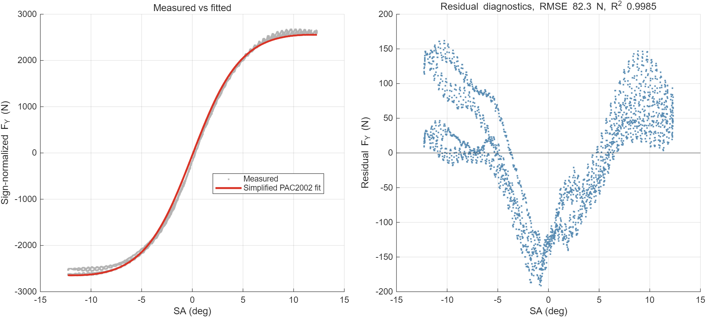

**图 2 简化 PAC2002 测量值与拟合值及残差**

这张图说明什么：拟合在当前 43075 rim 7 窗口内跟随测量趋势；已有指标为 R²=0.9985、RMSE=82.3 N、MAE=67.8 N。

它对悬架设计意味着什么：该模型适合做同一窗口内的载荷敏感性和能力比较，但不能外推为全压力、全外倾、全温度范围的完整轮胎模型。

> **工程纪律：** 模型拟合得好，只说明它在当前数据范围内复现了曲线；不等于全部工况都被验证。

## 3.3 Tire Load Sensitivity：为什么载荷转移会损失总抓地

FZ 是轮胎承受的垂向载荷，单位 N。μy=|FY|/FZ 表示每 1 N 垂向载荷大约能换来多少横向力。Load Sensitivity（载荷敏感性）指 FZ 增加时，μy 往往下降：外侧轮虽然更重、绝对横向力更大，但效率变差。

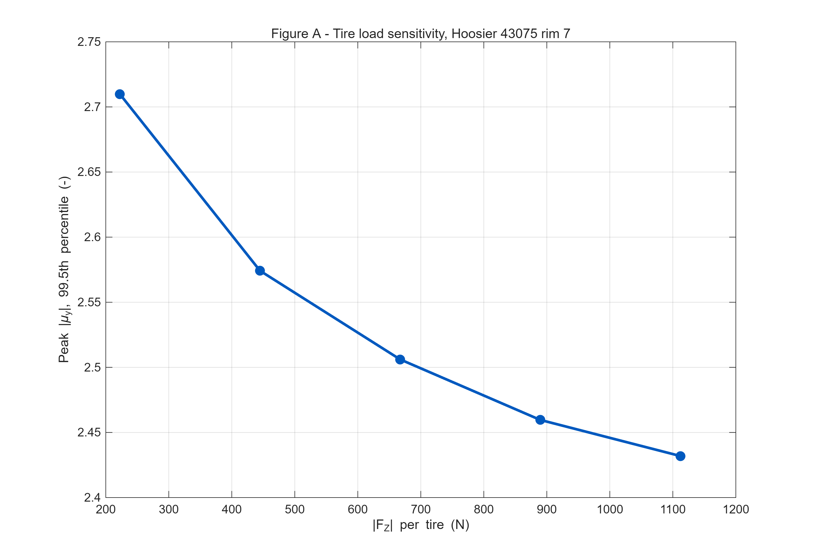

**图 3 Hoosier 43075 rim 7 的 μy–FZ 载荷敏感性**

这张图说明什么：峰值 |μy| 从约 2.710（222 N）下降到约 2.432（1112 N），显示明确的载荷敏感性。

它对悬架设计意味着什么：同一车轴左右轮载荷差越大，两条轮胎的总横向能力越可能下降；这直接引出前后轴如何分担载荷转移的 LLTD 问题。

这里的关键不是“外侧轮变重就没有抓地”，而是“载荷增加一倍，抓地力通常不会严格增加一倍”。因此，我们不能只看整车总载荷转移，还要看它在前后轴之间如何分配。

## 3.4 Camber Sensitivity：动态外倾不是一个固定最佳值

Camber（外倾角）是从车头看轮胎向内或向外倾斜的角度。TTC 表格中的 IA 是试验测得的 inclination angle，符号约定不能直接等同于车辆动态 camber。当前车静态外倾参考为 1.5 deg，因此报告使用最接近的约 2 deg 测量分箱进行比较，不编造 1.5 deg 插值。

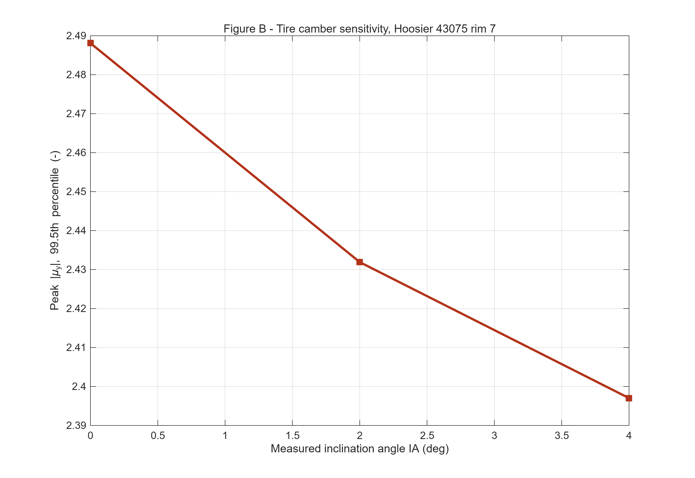

**图 4 43075 rim 7 的 IA 分箱敏感性**

这张图说明什么：在当前窗口中，IA 0/2/4 deg 的峰值 |μy| 约为 2.488/2.432/2.397，说明倾角会改变横向能力。

它对悬架设计意味着什么：悬架目标不是追求一个所有工况通用的“最佳 camber”，而是让高载荷外侧轮在 body roll 和 wheel travel 后仍处于可解释、可验证的工作窗口。

> **设计目标：** 建立 Dynamic Camber Working Window，并重点检查 Outside Front 和 Outside Rear。

## 4. Tire-to-Suspension 设计方法

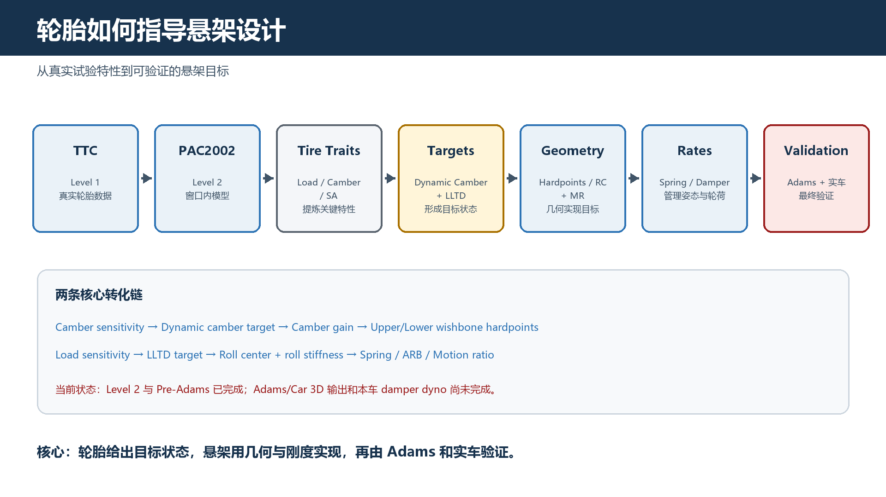

**图 5 从 TTC 到实际轮胎工作状态的设计链**

这张图说明什么：轮胎特性先形成目标轮胎状态，再转化为悬架运动学/动力学目标，最后由硬点、弹簧和阻尼实现并由 Adams 与实车验证。

它对悬架设计意味着什么：PAC2002 不能直接输出 XYZ 硬点；它提供的是 Dynamic Camber、FZ 管理、LLTD 和 SA/Toe 管理等约束。

| 轮胎特性 | 悬架需求 | 参数/硬点 |
| --- | --- | --- |
| Camber sensitivity | 控制动态外倾 | Camber gain；上下叉臂硬点 |
| Load sensitivity | 控制前后载荷转移 | LLTD；roll center；spring/ARB |
| 有效工作区 | 控制 wheel travel/body roll | Wheel rate；pushrod/rocker/damper |
| FZ(t) 波动 | 控制瞬态轮荷 | Damper 与 rocker geometry |
| FY–SA | 限制不合理 toe change | Tie-rod points；bump steer |

## 5.1 Camber Sensitivity → Camber Gain → Hardpoints

极限过弯时，外侧轮 FZ 上升，同时车身侧倾会让车轮相对地面的姿态发生变化。悬架需要通过 Camber Gain（车轮每上下移动 1 mm，外倾角改变多少）部分补偿这种姿态损失。Camber Gain 由上下控制臂的长度、角度和 Instant Center（瞬时中心）决定。

移动 Upper/Lower Wishbone 内外硬点后，控制臂长度和空间角度会变化，瞬时中心位置也随之改变。轮心上下运动时，Upright（转向节）不再沿原来的旋转轨迹运动，因此 camber gain 改变。轮胎数据提供“外侧高载荷轮需要什么动态外倾趋势”，几何设计再决定怎样实现。

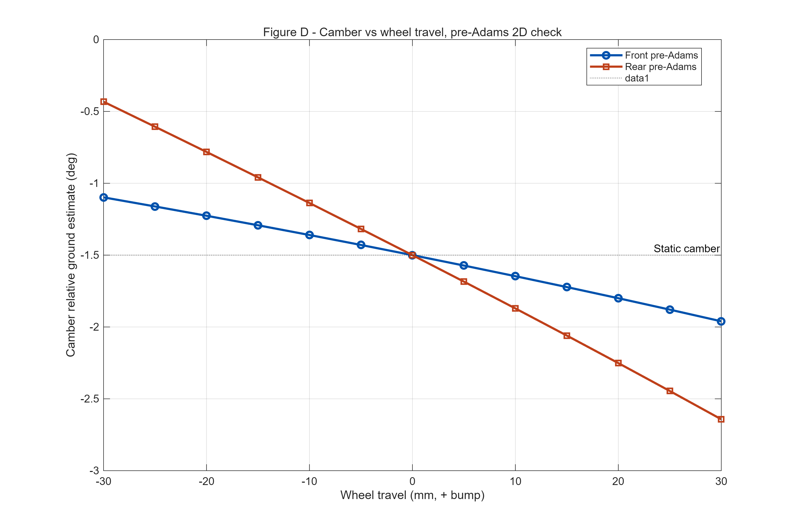

**图 6 第九版硬点的 Pre-Adams Camber vs Wheel Travel**

这张图说明什么：二维前视几何在 ±30 mm 行程内给出前/后近静态 camber gain 为 -0.0143/-0.0367 deg/mm。

它对悬架设计意味着什么：这可用于预判当前硬点的趋势并准备 Adams 输入，但没有包含完整 3D 约束、toe、pushrod/rocker 和真实 motion ratio。

> **证据标签：** Level 2 - Pre-Adams geometry calculation；不是 Adams/Car 输出。

## 5.2 第九版硬点审计与制造阶段含义

硬点是悬架各连接点的三维坐标。当前权威输入为 E18_hardpoint_V6a 中第九版（最终版），已导出为结构化 CSV，包含前后轴 upper/lower wishbone、pushrod、damper、rocker、tie rod 和 wheel center。报告没有移动或“优化”这些坐标。

| 审计项目 | 结果 | 工程处理 |
| --- | --- | --- |
| 最终前轮距 | 1250 mm | 按第九版 wheel center y 坐标 |
| 最终后轮距 | 1230 mm | 按第九版 wheel center y 坐标 |
| 用户记录轮距 | 1280/1250 mm | 与硬点不一致，明确披露 |
| 几何范围 | ±30 mm wheel travel | 只用于 Pre-Adams 趋势检查 |
| 制造阶段 | 硬点已完成 | 用后验验证和可调参数补充 |

> **为什么差异不能默默忽略：** 轮距直接进入载荷转移和侧倾几何计算。报告按最终硬点实际坐标使用 1250/1230 mm，同时保留 1280/1250 mm 的原始记录作为一致性问题。

Tie-rod、caster、KPI、track change 等参数目前没有可靠 3D 输出。本报告不为了显得“悬架参数齐全”而给出未经验证的数值，也不强行把包装、回正和结构约束全部归因于 PAC2002。

## 6. Load Sensitivity → LLTD = 45%

LLTD 是 Lateral Load Transfer Distribution，意思是整车过弯产生的左右轮载荷差，有多少由前轴承担、多少由后轴承担。当前 Front LLTD=45%，Rear LLTD=55%。它不是静态轴荷，也不是前后制动力分配。

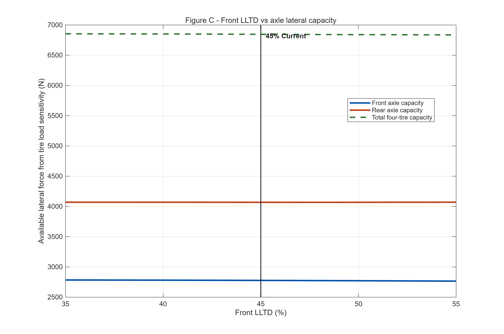

**图 7 LLTD 对前后轴轮胎能力的影响**

这张图说明什么：在 35%–55% 扫描中，45% 时前轴能力 2777 N、后轴 4069 N、总计 6846 N，前/后能力比 0.683。

它对悬架设计意味着什么：45% 是当前平衡 baseline，不是模型证明的唯一最优点；简单载荷模型在扫描范围内把最高总能力放在约 35%。

> **因果链：** 横向加速度 → 总载荷转移 → 前后轴分担 → 四轮 FZ 改变 → 载荷敏感性改变轴能力 → 整车平衡改变。

该扫描忽略 slip angle distribution、aero、瞬态和有符号动态 camber，因此只能说明载荷敏感性趋势和前后能力分配，不能单独决定最终操稳平衡。

## 7. LLTD 如何由 Roll Center 与侧倾刚度分配实现

LLTD 目标需要通过两条路径实现。Geometric Load Transfer（几何载荷转移）主要受 roll center height、轮距和悬架几何影响；Elastic Load Transfer（弹性载荷转移）主要受前后 roll stiffness、spring、motion ratio 和 ARB 影响。两者相加，才形成前后轴实际承担的载荷差。

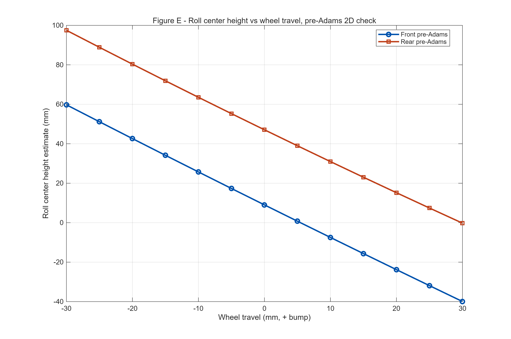

**图 8 Pre-Adams Roll Center vs Wheel Travel**

这张图说明什么：二维前视估计的静态 front/rear roll center 高度约 9.0/47.1 mm，并显示随 wheel travel 迁移。

它对悬架设计意味着什么：Roll center 不是追求某个“标准高度”，而要在几何载荷转移、roll moment arm、jacking、body roll 和最终轮胎状态之间折中。

| 现有 Level 2 结果 | 前轴 | 后轴 |
| --- | --- | --- |
| 几何载荷差 | 14.3 N | 113.5 N |
| 45% LLTD 目标载荷差 | 502.6 N | 614.3 N |
| 剩余弹性载荷差 | 488.3 N | 500.8 N |

> **当前推导：** 简化结果对应 Elastic Front Roll Stiffness Share 约 49.4%；必须由 Adams 和真实 motion ratio 复核。

## 8.1 Motion Ratio：轮胎、弹簧与硬点之间的桥梁

Spring 并不直接装在轮心。Motion Ratio（运动比）描述车轮移动与弹簧/减振器移动之间的比例。相同 spring rate 在不同 motion ratio 下，会得到不同 wheel rate；而 wheel rate 决定 wheel travel 和 body roll，进一步影响动态外倾和轮胎垂向载荷。

> **设计链：** 轮胎需要控制 FZ 与 Dynamic Camber → 需要控制 Wheel Travel 与 Body Roll → 需要合适 Wheel Rate → Motion Ratio 把 Spring Rate 转换成 Wheel Rate。

| 第九版相关硬点 | 作用 | 当前证据状态 |
| --- | --- | --- |
| Pushrod inner/outer | 把轮端运动传到 rocker | 坐标已导出 |
| Rocker pivot/axis | 决定摇臂旋转几何 | 坐标已导出 |
| Damper inner/outer | 决定减振器行程与方向 | 坐标已导出 |
| Motion ratio vs travel | 把 spring/damper 转为轮端效果 | 尚无可靠 3D 曲线 |

> **不能越过的证据缺口：** 没有 Adams/Car 或完整 3D 约束模型，就不能把当前 wheel-rate 参数研究倒推出最终 spring hardware rate。

因此，pushrod 和 rocker 硬点虽然不直接改变轮胎材料，却决定弹簧和减振器在轮端实际产生多大效果。这是轮胎需求最终落到包装和硬点上的关键桥梁。

## 8.2 Wheel Rate / Spring → Roll → Dynamic Camber

弹簧选择不能只用“车不能太软”来解释。过软会带来更大 roll 和 wheel travel，使动态外倾更容易偏离目标；过硬则可能使轮胎更难顺应路面，增加垂向载荷波动并降低机械抓地。正确问题是：在哪个轮端刚度范围内，姿态控制与贴地能力能够共同接受？

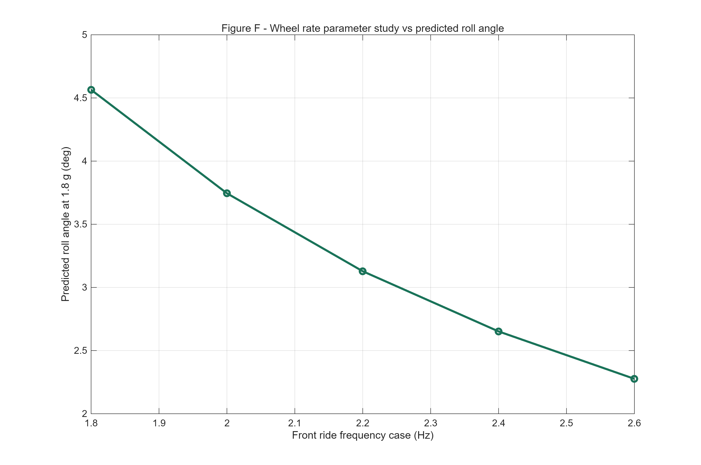

**图 9 Wheel Rate 参数研究与 1.8g 预测侧倾角**

这张图说明什么：从 Soft 到 Stiff，前轮端刚度约 7.16→14.94 N/mm、后轮端刚度约 13.26→26.00 N/mm，预测 roll angle 由 4.56→2.28 deg。

它对悬架设计意味着什么：提高 wheel rate 能降低简化模型中的侧倾，但这不是“越硬越好”的证明；结果只用于建立初始试车范围。

> **标签：** Parameter Study - not final vehicle hardware specification。

## 8.3 Spring 参数如何回到轮胎工作状态

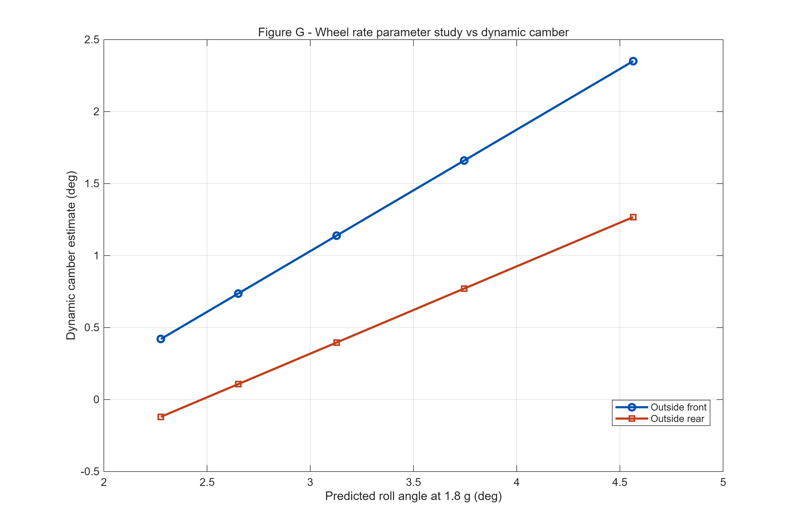

**图 10 Wheel Rate 参数研究与外侧轮动态外倾**

这张图说明什么：简化模型把不同 ride-frequency case 对应的 roll angle、wheel travel 与 Pre-Adams camber gain 串联，得到 OF/OR 动态外倾趋势。

它对悬架设计意味着什么：该图帮助筛除姿态明显不合理的初始范围，但因 motion ratio、Adams body roll 和真实轮胎有符号 camber 关系尚未完成，不能宣布唯一最佳弹簧。

| Case | 前/后频率 Hz | Roll deg | OF/OR camber deg |
| --- | --- | --- | --- |
| Soft | 1.8 / 2.0 | 4.56 | 2.35 / 1.27 |
| Medium | 2.2 / 2.4 | 3.13 | 1.14 / 0.40 |
| Stiff | 2.6 / 2.8 | 2.28 | 0.42 / -0.12 |

表中 camber 来自 1.5 deg 静态参考、简化 roll 与 Pre-Adams camber gain 的组合，只用于趋势。最终 spring/wheel-rate 范围必须由实测 motion ratio、轮胎温度/磨耗和驾驶员反馈收敛。

## 9. Damper → FZ(t) → Tire Transient Performance

稳态过弯中，spring 和 ARB 对最终载荷分配影响较大；车辆刚开始转向、快速变向或压路肩时，轮胎载荷不会瞬间到达最终值，而是形成随时间变化的 FZ(t)。Damper（减振器）通过控制悬架运动速度，影响 roll build-up、wheel load transfer build-up、载荷波动和 settling time。

> **轮胎视角：** 轮胎需要相对稳定的法向载荷 → 悬架运动产生 FZ 波动 → damper 控制运动速度 → 影响瞬态轮荷 → 影响瞬态轮胎力。

| 已有资料 | 能支持什么 | 不能支持什么 |
| --- | --- | --- |
| Ohlins TTX25 MkII dyno PDF | 理解调节器扫掠和力-速度曲线形式 | 不能证明是本车实测曲线 |
| 第九版 damper/rocker 硬点 | 准备 motion ratio 与包装检查 | 目前没有真实 velocity ratio |
| Spring 参数研究 | 给出姿态趋势 | 不能给出最终 damping click/valve |

> **当前结论：** 目前只能进行参数化趋势研究；最终阻尼值需要本车减振器台架数据和实车测试确定。

## 10. Adams/Car 验证状态

Adams 2020 命令入口已经找到，但直接 -help 探测返回“-help is not a valid selection code”。本轮没有创建可验证的 Adams/Car 模型，也没有导出 camber、toe、roll center、motion ratio 或 body roll 结果。

| 项目 | 状态 | 文件/下一步 |
| --- | --- | --- |
| 第九版硬点导入表 | 完成 | E18_hardpoint_V6a_ninth_final_for_adams.csv |
| Parallel wheel travel ±30 mm | 未完成 | 需导出 camber/toe/RC/MR |
| Body roll analysis | 未完成 | 需得到真实 dynamic camber |
| Motion ratio vs travel | 未完成 | 用于 spring/damper 转换 |
| 1.8g Adams operating state | 未完成 | 替换 Figure H 的 Pre-Adams 坐标 |

> **答辩底线：** 可以说“Adams 输入已准备，Pre-Adams 趋势已检查”；不能说“Adams 已验证当前硬点”。

当 Adams 输出完成后，必须用同一坐标定义、同一正负号和同一 wheel-travel 范围导出 CSV，再替换报告中所有带 Pre-Adams 标签的动态外倾、侧倾中心和 1.8g 姿态图。

## 11. 1.8g 极限过弯：四条轮胎实际处于什么状态

该案例使用 280 kg、1.8g、40:60 静态轴荷和 45:55 LLTD。它首先给出四轮 FZ，再用现有载荷敏感性曲线估算可用横向能力。图中的 wheel travel 和 camber 采用 1.5 deg roll reference 与 Pre-Adams 曲线，只是验证框架，不是 Adams 结果。

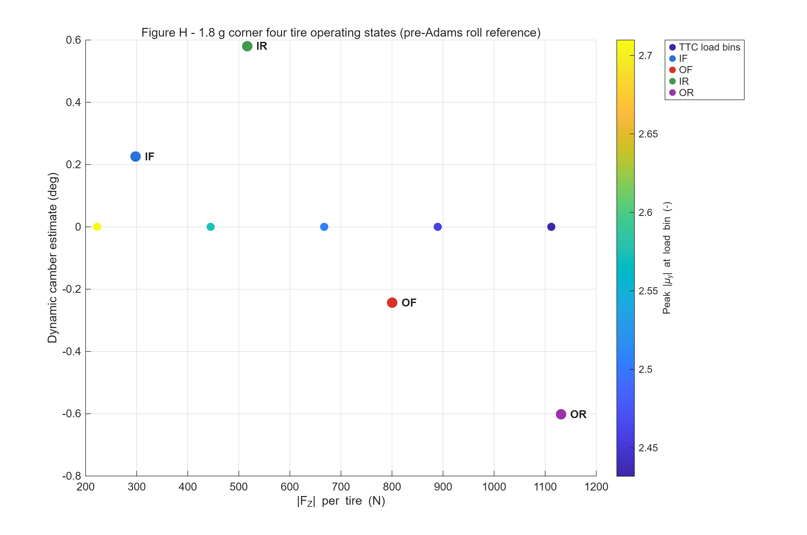

**图 11 1.8g、45% LLTD 下四轮 FZ 与工作状态框架**

这张图说明什么：IF/OF/IR/OR 的 FZ 为 297.9/800.5/516.6/1130.9 N；对应载荷模型能力为 793.4/1983.8/1318.5/2750.3 N。

它对悬架设计意味着什么：OF 与 OR 承担主要横向力，其中 OR 是最高载荷轮胎；OR 载荷略高于 1112 N 最高测量分箱，模型按上限夹紧，不能当作已验证外推。

> **高载荷外侧轮：** 当前框架给出 OF/OR 动态 camber 约 -0.243/-0.602 deg，但它们属于 Level 2 Pre-Adams 坐标，必须由 Adams body roll 结果替换。

## 12. 当前悬架设计评估

| 设计项 | 现有证据支持程度 | 当前判断 |
| --- | --- | --- |
| 轮胎选型与载荷敏感性 | 较强：TTC + 表格 + 曲线 | 可用于解释 LLTD 必要性 |
| 45% LLTD | 中等：简化 capacity sweep | 合理 baseline；非唯一最优 |
| Camber gain | 中等：第九版 + 2D Pre-Adams | 趋势可解释；待 3D 验证 |
| Roll center | 中等偏弱：2D Pre-Adams | 只作前期趋势与刚度分配输入 |
| Motion ratio | 不足 | 坐标有，曲线无 |
| Spring | 中等偏弱：参数研究 | 给初始 wheel-rate 范围 |
| Damper | 不足：无本车 dyno | 不能给最终设置 |
| Adams | 未完成 | 不得宣称仿真验证 |

> **总体判断：** 现有设计已经具备从轮胎数据到 LLTD、硬点趋势和弹簧范围的可追溯解释；真正缺少的是完整 3D 运动学、motion ratio、body roll 和本车阻尼实测。

这意味着答辩时应强调“设计逻辑与证据链已经建立，验证计划明确”，而不是把未完成项目包装成完成。工程诚信本身也是答辩可信度的一部分。

## 13. 可调参数与实车调校建议

制造完成后，仍可通过静态外倾、轮胎压力、spring/ARB、damper 和车高等参数调整轮胎工作状态。调校应按“目标-测量-修改-复测”进行，不应只凭主观感觉同时改动多个参数。

| 可调项 | 轮胎目标 | 当前建议使用的证据 |
| --- | --- | --- |
| Static camber | 让高载荷外侧轮进入合适动态窗口 | 以 1.5 deg 车端参考对照最近的 IA≈2 deg 测量 |
| Spring / ARB | 管理 roll、wheel travel 与 LLTD | 从参数研究范围开始，结合 Adams MR 与温度 |
| Damper | 管理 FZ(t) 与姿态建立速度 | 先获得本车 dyno，再做 step/操稳测试 |
| Toe | 避免 SA 被几何变化扰动 | Adams bump-steer 曲线 + 直线稳定性 |
| Ride height | 控制 RC、roll arm 和可用行程 | Adams + 地面间隙/气动平台要求 |

> **一次只回答一个问题：** 例如先固定压力和静态外倾，比较两组 wheel rate；再固定 spring，比较 damper transient。否则无法把轮胎温度、驾驶反馈和圈速变化归因到具体参数。

## 14. 限制与下一步验证计划

| 缺口 | 为什么重要 | 完成判据 |
| --- | --- | --- |
| Adams 3D kinematics | 确认 camber/toe/RC/MR | 导出可复现 CSV 与曲线 |
| Body roll analysis | 得到外侧轮真实动态外倾 | 替换所有 Pre-Adams 1.8g 坐标 |
| Motion ratio measurement | 把 wheel rate 转成 spring rate | Adams 曲线 + 实车行程比测量 |
| 本车 damper dyno | 定义 force-velocity 与 click | 四角或配对曲线，有温度/速度说明 |
| 轮胎有符号 camber 模型 | 统一 TTC IA 与车端符号 | 明确坐标与测量窗口 |
| 实车验证 | 确认温度、磨耗、平衡与圈速 | 固定工况 A/B 测试记录 |

> **当前资料不足的项目：** Toe vs travel、true motion ratio、caster/KPI 动态影响、最终 spring hardware、最终 damper setting，均不能做定量结论。

下一轮报告更新应以 Adams 导出 CSV 和本车测试数据为触发条件，而不是只更新文字。任何新曲线都应保留输入版本、坐标定义、单位、运行工况和脚本来源。

## 15. 结论

- TTC/PAC2002 说明 43075 rim 7 存在明确载荷敏感性和倾角敏感性，因此悬架必须管理 FZ、动态外倾与 SA。
- 45% Front LLTD 是当前 baseline；现有简化模型支持其作为平衡讨论起点，但不支持“唯一最优”的说法。
- 1.8g 案例中 OR 载荷最高，OF/OR 是动态外倾和轮荷验证重点；OR 位于最高测量载荷分箱之外，当前能力按上限夹紧。
- 第九版硬点给出前/后轮距 1250/1230 mm，并已完成 Pre-Adams camber 与 roll-center 趋势检查；它们不是 Adams 结果。
- Spring 研究只建立 wheel-rate 与姿态的初始范围；真实 spring rate 需要 motion ratio，最终阻尼需要本车 dyno 与试车。
- Adams 输入已准备，但 Adams/Car 三维运动学和 body roll 尚未完成。

> **一句话总结：** 因为本车轮胎在特定 FZ、IA 和 SA 下表现出这些特性，所以悬架需要产生相应的动态外倾、载荷转移、轮端刚度和瞬态轮荷管理；当前硬点与可调参数应按这条证据链验证，而不是按经验口号证明。

## 附录 A：关键数值与证据追溯

| 结论/数值 | 源文件 | 等级 |
| --- | --- | --- |
| μy 2.710→2.432 | PEAK_MU_BY_FZ.csv | L1/表格整理 |
| IA 0/2/4: 2.488/2.432/2.397 | CAMBER_SENSITIVITY.csv | L1/表格整理 |
| PAC R²=0.9985, RMSE=82.3 N | PAC2002_SIMPLIFIED_FIT_METRICS.csv | L2 |
| 45%: 2777/4069/6846 N | LLTD_capacity_sweep.csv | L2 |
| Track 1250/1230 mm | hardpoints_final_structured.csv | L2 几何审计 |
| Camber gain -0.0143/-0.0367 | camber_gain_summary_pre_adams.csv | L2 Pre-Adams |
| RC 9.0/47.1 mm | pre_adams_2d_kinematics.csv | L2 Pre-Adams |
| 1.8g 四轮 FZ | corner_1p8g_wheel_loads_current_LLTD.csv | L2 |
| Roll 4.56→2.28 deg | spring_wheel_rate_parameter_study.csv | L2 参数研究 |
| Adams 未完成 | Adams_Model_Status.md | 状态记录 |

> **使用规则：** 凡是引用 Pre-Adams 的场合，图题、正文和口头表述都要带上 Pre-Adams；凡是没有本车 damper dyno 的场合，不给最终阻尼数值。

## 附录 B：术语与最少公式

| 术语 | 大白话解释 | 本报告用途 |
| --- | --- | --- |
| FZ | 轮胎被地面顶住的垂向力，N | 决定载荷敏感性和四轮工况 |
| FY | 轮胎提供的横向力，N | 用于过弯 |
| SA | 轮胎指向与实际运动方向之差，deg | 决定横向力建立 |
| Camber/IA | 轮胎从车头看倾斜的角度，deg | 影响接地与横向能力 |
| LLTD | 前轴承担整车左右载荷差的比例 | 连接载荷敏感性与前后平衡 |
| Roll Center | 悬架几何支撑侧倾的等效高度 | 影响几何载荷转移和 roll arm |
| Motion Ratio | 轮端行程与弹簧/减振器行程的比例 | 把硬件刚度转成 wheel rate |

公式 1：μy=|FY|/FZ。FY 和 FZ 单位都是 N，因此 μy 无量纲。它用来说明轮胎在不同载荷下的抓地效率。

公式 2：m·ay·h = ΔFzf·tf + ΔFzr·tr。m 为质量 kg，ay 为横向加速度 m/s²，h 为重心高度 m，ΔFz 为左右轮载荷差 N，t 为轮距 m。它把整车侧倾力矩与前后轴载荷差联系起来。

> **注意：** 公式只负责建立物理关系；真正的结论仍以已有 CSV、图和边界条件为准。

## 轮胎如何指导悬架设计——一页逻辑总结

**答辩/PPT 可直接使用的一页设计链**

这张图说明什么：从 TTC、PAC2002 到目标轮胎状态，再到硬点、roll center、motion ratio、spring/damper 和 Adams/实车验证。

它对悬架设计意味着什么：当前已完成到 Level 2 计算与 Pre-Adams 检查；Adams/Car 和本车阻尼数据仍是下一道验证门。

> **答辩主句：** 不是因为 Formula Student 赛车通常这样设计，所以我们这样设计；而是因为我们的轮胎在特定 FZ、IA 和 SA 下表现出这些特性，所以悬架必须产生相应的运动学和载荷转移特性。
